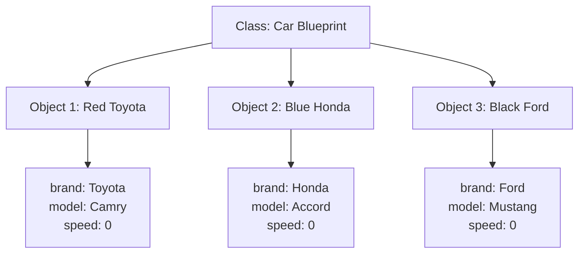
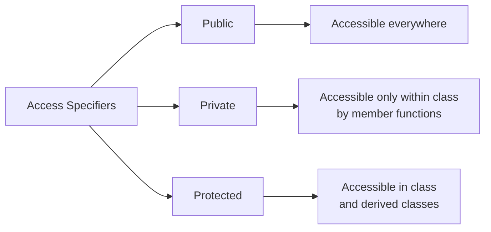
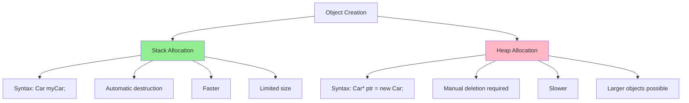

# Classes and Objects in C++

## Table of Contents

1. [What is a Class?](#1-what-is-a-class)
2. [What is an Object?](#2-what-is-an-object)
3. [Class Members: Attributes and Member Functions](#3-class-members-attributes-and-member-functions)
   - [Attributes (Data Members)](#31-attributes-data-members)
   - [Member Functions (Methods)](#32-member-functions-methods)
4. [Access Specifiers](#4-access-specifiers)
   - [Public](#41-public)
   - [Private](#42-private)
   - [Protected](#43-protected)
   - [Access Specifier Comparison](#44-access-specifier-comparison)
   - [When to Use Which Access Specifier](#45-when-to-use-which-access-specifier)
5. [Creating Objects of a Class](#5-creating-objects-of-a-class)
   - [Static Allocation (Stack)](#51-static-allocation-stack)
   - [Dynamic Allocation (Heap)](#52-dynamic-allocation-heap)
   - [Array of Objects](#53-array-of-objects)
   - [Creating Objects with Different Access](#54-creating-objects-with-different-access)
   - [Comparison: Stack vs Heap Allocation](#55-comparison-stack-vs-heap-allocation)
6. [Summary](#summary)

---

## 1. What is a Class?

A **class** is a user-defined blueprint or template for creating objects. It defines a data structure that bundles data (attributes) and functions (methods) that operate on that data together.

### Real-World Example: Car

Think of a class as a blueprint for a car. The blueprint defines:
- **Properties**: color, brand, model, speed, fuel level
- **Behaviors**: start engine, accelerate, brake, turn

Just like a car blueprint isn't an actual car, a class itself isn't an object—it's just the design specification.

```cpp
class Car {
    // Attributes (data members)
    string brand;
    string model;
    int year;
    double speed;
    
    // Member functions (methods)
    void startEngine() {
        cout << "Engine started!" << endl;
    }
    
    void accelerate() {
        speed += 10;
        cout << "Speed: " << speed << " km/h" << endl;
    }
};
```

[↑ Back to Table of Contents](#table-of-contents)

---

## 2. What is an Object?

An **object** is an instance of a class. It's a concrete entity created from the class blueprint that occupies memory and has actual values.

### Relating to Real-World Example

Using our car analogy:
- **Class (Car)**: The blueprint/design document
- **Objects**: Actual cars manufactured from that blueprint
  - Object 1: A red Toyota Camry 2023
  - Object 2: A blue Honda Accord 2024
  - Object 3: A black Ford Mustang 2022

Each object has its own set of attribute values but shares the same structure and behaviors defined by the class.

```cpp
Car myCar;      // Object 1
Car yourCar;    // Object 2
Car rentalCar;  // Object 3
```



[↑ Back to Table of Contents](#table-of-contents)

---

## 3. Class Members: Attributes and Member Functions

### 3.1 Attributes (Data Members)

Attributes are variables that hold the state or properties of an object. They represent the characteristics of the object.

**Examples:**
- For a `Car` class: `brand`, `model`, `year`, `speed`, `fuelLevel`
- For a `Student` class: `name`, `rollNumber`, `grade`, `age`
- For a `BankAccount` class: `accountNumber`, `balance`, `accountHolder`

### 3.2 Member Functions (Methods)

Member functions are functions defined inside a class that operate on the object's data. They represent the behaviors or actions an object can perform.

**Types of Member Functions:**

1. **Functions that modify object state**
   ```cpp
   void accelerate() {
       speed += 10;
   }
   ```

2. **Functions that retrieve information**
   ```cpp
   double getSpeed() {
       return speed;
   }
   ```

3. **Functions that perform operations**
   ```cpp
   void displayInfo() {
       cout << brand << " " << model << endl;
   }
   ```

### Complete Example

```cpp
class BankAccount {
    // Attributes
    string accountHolder;
    long accountNumber;
    double balance;
    
    // Member Functions
    void deposit(double amount) {
        balance += amount;
        cout << "Deposited: $" << amount << endl;
    }
    
    void withdraw(double amount) {
        if (balance >= amount) {
            balance -= amount;
            cout << "Withdrawn: $" << amount << endl;
        }
    }
    
    double getBalance() {
        return balance;
    }
};
```

[↑ Back to Table of Contents](#table-of-contents)

---

## 4. Access Specifiers

Access specifiers control the accessibility of class members from outside the class. C++ provides three access specifiers:

### 4.1 Public

Members declared as `public` are accessible from anywhere in the program.

```cpp
class Car {
public:
    string brand;  // Can be accessed from anywhere
    
    void startEngine() {  // Can be called from anywhere
        cout << "Engine started!" << endl;
    }
};
```

**Usage:**
```cpp
Car myCar;
myCar.brand = "Toyota";      // ✓ Allowed
myCar.startEngine();         // ✓ Allowed
```

### 4.2 Private

Members declared as `private` are only accessible within the class itself. This is the **default** access level in C++.

**Key Points:**
- Private data members **cannot** be accessed directly from outside the class
- Private data members **can** be accessed by member functions within the same class
- Member functions can read, modify, and manipulate private data members

```cpp
class BankAccount {
private:
    double balance;  // Cannot be accessed directly from outside
    
    void updateLog() {  // Cannot be called from outside
        // Internal logging function
    }
    
public:
    void deposit(double amount) {
        balance += amount;  // ✓ Member function CAN access private data
        updateLog();        // ✓ Member function CAN call private function
    }
    
    double getBalance() {
        return balance;     // ✓ Member function CAN access private data
    }
    
    void showDetails() {
        cout << "Balance: $" << balance << endl;  // ✓ Accessing private member
        updateLog();                               // ✓ Calling private function
    }
};
```

**Usage:**
```cpp
BankAccount account;
account.balance = 1000;      // ✗ Error: balance is private, cannot access from outside
account.updateLog();         // ✗ Error: updateLog is private, cannot call from outside
account.deposit(1000);       // ✓ Allowed: deposit is public
account.getBalance();        // ✓ Allowed: getBalance is public (internally accesses private balance)
```

**Summary:**
- Private members are **hidden from outside** the class
- Private members are **accessible to all member functions** inside the class
- This provides **data encapsulation** and **security**

### 4.3 Protected

Members declared as `protected` are accessible within the class and by derived (child) classes.

```cpp
class Vehicle {
protected:
    int speed;  // Accessible in Vehicle and its derived classes
    
public:
    void setSpeed(int s) {
        speed = s;
    }
};
```

> **Note:** Protected access specifier is primarily used in inheritance and will be discussed in detail in the **Inheritance** section.

### 4.4 Access Specifier Comparison



### 4.5 When to Use Which Access Specifier

| Access Specifier | When to Use | Example Use Cases | Benefits |
|-----------------|-------------|-------------------|----------|
| **Public** | For interfaces that need to be accessed from anywhere | • Getter/Setter methods<br>• Public utility functions<br>• Methods that define class behavior | • Easy access<br>• Clear interface<br>• User-friendly |
| **Private** | For internal implementation details that should be hidden | • Data members (variables)<br>• Helper/utility functions<br>• Internal calculations<br>• Sensitive data | • Data protection<br>• Encapsulation<br>• Security<br>• Prevents accidental modification |
| **Protected** | For members that should be accessible to derived classes | • Attributes shared with child classes<br>• Functions used by inheritance hierarchy | • Supports inheritance<br>• Controlled access in hierarchy<br>• Flexibility for derived classes |

**Best Practice Example:**
```cpp
class Student {
private:
    // Private: Internal data that should be protected
    string name;
    int rollNumber;
    float marks;
    int age;
    
    // Private: Internal helper function
    bool validateMarks(float m) {
        return (m >= 0 && m <= 100);
    }
    
protected:
    // Protected: For use in derived classes (e.g., GraduateStudent)
    string department;
    
public:
    // Public: Interface for outside world to interact with the class
    void setName(string n) {
        name = n;
    }
    
    string getName() {
        return name;
    }
    
    void setMarks(float m) {
        if (validateMarks(m)) {  // Using private helper function
            marks = m;
        }
    }
    
    float getMarks() {
        return marks;
    }
    
    void displayInfo() {
        cout << "Name: " << name << ", Roll: " << rollNumber 
             << ", Marks: " << marks << endl;
    }
};
```

**Decision Guide:**
1. **Start with private** - Make everything private by default
2. **Expose what's needed** - Make only necessary methods public
3. **Use protected for inheritance** - When planning class hierarchies
4. **Never expose data directly** - Use getter/setter methods instead

[↑ Back to Table of Contents](#table-of-contents)

---

## 5. Creating Objects of a Class

There are multiple ways to create objects in C++. Here are the various approaches:

### 5.1 Static Allocation (Stack)

Objects are created on the stack and automatically destroyed when they go out of scope.

```cpp
// Syntax: ClassName objectName;
Car myCar;              // Object created on stack
Student student1;       // Another object
BankAccount account;    // One more object
```

**Characteristics:**
- Memory allocated on the stack
- Automatic destruction when scope ends
- Faster allocation
- Limited by stack size

### 5.2 Dynamic Allocation (Heap)

Objects are created on the heap using the `new` keyword and must be manually deleted.

```cpp
// Syntax: ClassName* objectName = new ClassName;
Car* carPtr = new Car;           // Object created on heap
Student* studentPtr = new Student;

// Using the object
carPtr->startEngine();

// Must manually delete to free memory
delete carPtr;
delete studentPtr;
```

**Characteristics:**
- Memory allocated on the heap
- Manual memory management required
- Slower allocation than stack
- Can allocate larger objects
- Persists until explicitly deleted

### 5.3 Array of Objects

You can create multiple objects using arrays.

**Static Array:**
```cpp
// Array of objects on stack
Car cars[5];            // Creates 5 Car objects
cars[0].startEngine();
cars[1].accelerate();
```

**Dynamic Array:**
```cpp
// Array of objects on heap
Car* carArray = new Car[10];  // Creates 10 Car objects
carArray[0].startEngine();

// Must delete the array
delete[] carArray;
```

### 5.4 Creating Objects with Different Access

```cpp
class Example {
private:
    int privateData;
    
public:
    int publicData;
    
    void display() {
        cout << "Example object created!" << endl;
    }
};

// Creating and using objects
Example obj1;                    // Stack allocation
obj1.publicData = 100;           // Accessing public member
obj1.display();                  // Calling public method
// obj1.privateData = 50;        // ✗ Error: Cannot access private member

Example* obj2 = new Example;     // Heap allocation
obj2->publicData = 200;
obj2->display();
delete obj2;
```

### 5.5 Comparison: Stack vs Heap Allocation



### Complete Example: Different Ways to Create Objects

```cpp
#include <iostream>
using namespace std;

class Rectangle {
private:
    double length;
    double width;
    
public:
    void setDimensions(double l, double w) {
        length = l;
        width = w;
    }
    
    double getArea() {
        return length * width;
    }
    
    void display() {
        cout << "Rectangle: " << length << " x " << width 
             << " = " << getArea() << " sq units" << endl;
    }
};

int main() {
    // Method 1: Stack allocation
    Rectangle rect1;
    rect1.setDimensions(5.0, 3.0);
    rect1.display();
    
    // Method 2: Heap allocation
    Rectangle* rect2 = new Rectangle;
    rect2->setDimensions(4.0, 6.0);
    rect2->display();
    delete rect2;  // Don't forget to delete!
    
    // Method 3: Array of objects
    Rectangle rooms[3];
    rooms[0].setDimensions(10.0, 12.0);
    rooms[1].setDimensions(8.0, 10.0);
    rooms[2].setDimensions(6.0, 8.0);
    
    for (int i = 0; i < 3; i++) {
        cout << "Room " << i + 1 << ": ";
        rooms[i].display();
    }
    
    return 0;
}
```

[↑ Back to Table of Contents](#table-of-contents)

---

## Summary

- **Class**: A blueprint that defines structure and behavior
- **Object**: An instance of a class with actual data
- **Attributes**: Variables that store object properties
- **Member Functions**: Functions that define object behaviors (can access private members)
- **Access Specifiers**: Control visibility (public, private, protected)
- **Object Creation**: Can be done on stack or heap, as single objects or arrays

This foundation prepares you for more advanced topics like constructors, destructors, and inheritance!

[↑ Back to Table of Contents](#table-of-contents)